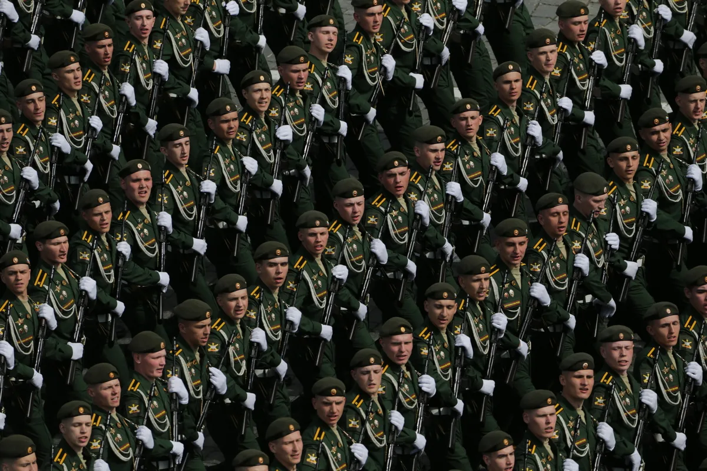
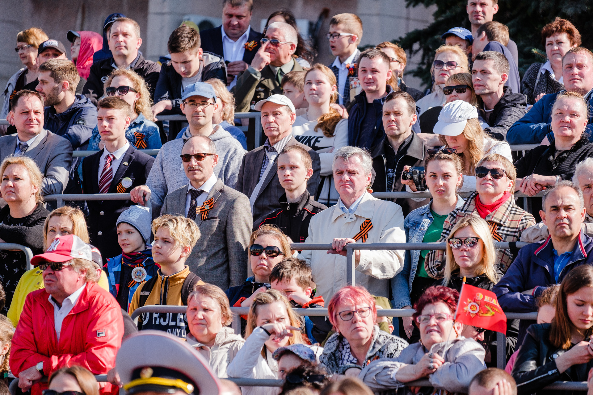

# Face Detection
---

## Как использовать

1. Создайте папку с именем `FaceDataset`
2. Поместите в неё все изображения, которые необходимо обработать
3. Запустите скрипт:

   ```bash
   python face_detection.py
   ```
4. Обработанные изображения с обнаруженными лицами будут сохранены в папке `FaceDetectionResults`

---

---

## Основные особенности решения

* Используются **несколько каскадов Хаара**:

  * Стандартный `haarcascade_frontalface_default`
  * Альтернативные (`alt`, `alt2`)
* Поиск **профильных лиц**
* Опциональная поддержка **DNN-детектора** 

* **Выравнивание гистограммы** для повышения контрастности
* Применение **CLAHE** (адаптивное выравнивание) для работы со сложными изображениями


* Используется **Non-Maximum Suppression (NMS)** для фильтрации перекрывающихся прямоугольников


### Что получается на выходе

* Генерация сравнительных изображений **до / после обработки**
* Сохранение всех обработанных изображений в отдельную папку


## Пример работы


### Пример 1




### Пример 2




