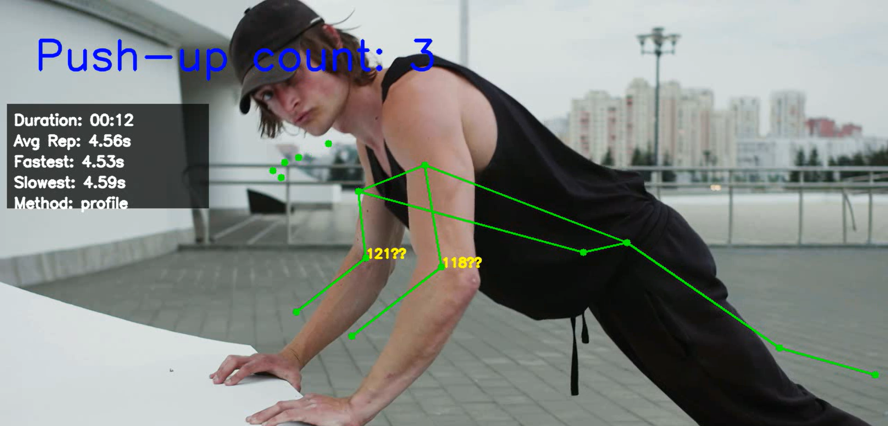
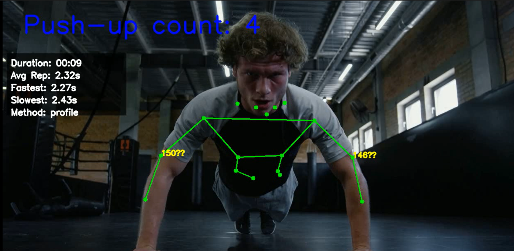
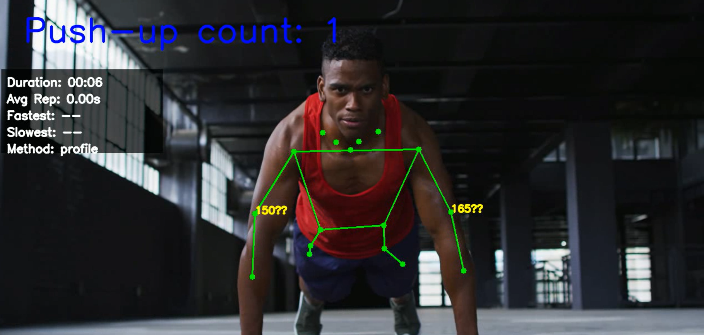

# Инструкция по использованию счетчика отжиманий

Это приложение автоматически считает количество отжиманий с помощью компьютерного зрения. Оно использует модель MoveNet для отслеживания положения тела и определения фаз отжимания.

## Требования

- Python 3.6+
- OpenCV (`cv2`)
- TensorFlow
- TensorFlow Hub

## Установка

```bash
pip install opencv-python numpy tensorflow tensorflow-hub
```

## Использование

### Базовый запуск

Запустите программу с веб-камерой по умолчанию:

```bash
python pushup_counter.py
```

### Дополнительные параметры

- `--video`: Путь к видеофайлу или индекс камеры (по умолчанию: 0 - веб-камера)
- `--elbow-angle-threshold`: Пороговый угол сгиба локтя (по умолчанию: 120 градусов)
- `--height-threshold-ratio`: Коэффициент изменения высоты для определения положений (по умолчанию: 0.1)

Пример с видеофайлом:

```bash
python pushup_counter.py --video путь_к_видео.mp4
```

## Как это работает

1. Программа анализирует позу человека в реальном времени
2. Определяет положение "вверх" и "вниз" на основе угла локтя и высоты тела
3. Считает полные повторения отжиманий
4. Отображает статистику тренировки
5. Сохраняет видео с результатами анализа

## Интерфейс

- Зеленые точки и линии показывают обнаруженные части тела
- Числа возле локтей показывают текущий угол сгиба
- Прогресс-бар внизу показывает текущую фазу отжимания
- Статистика отображает длительность, среднее время на повторение, и др.

## Управление

- Нажмите `Esc` для завершения

## Результаты использования




