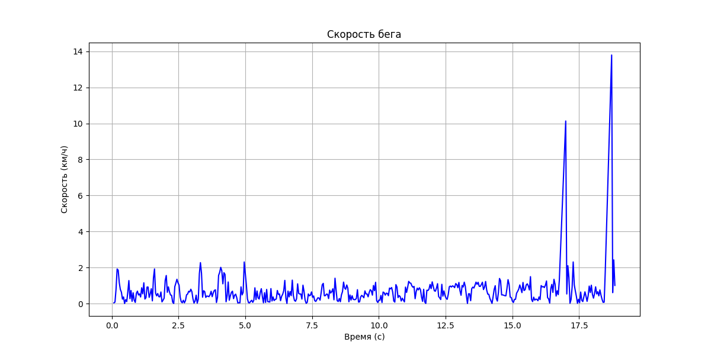
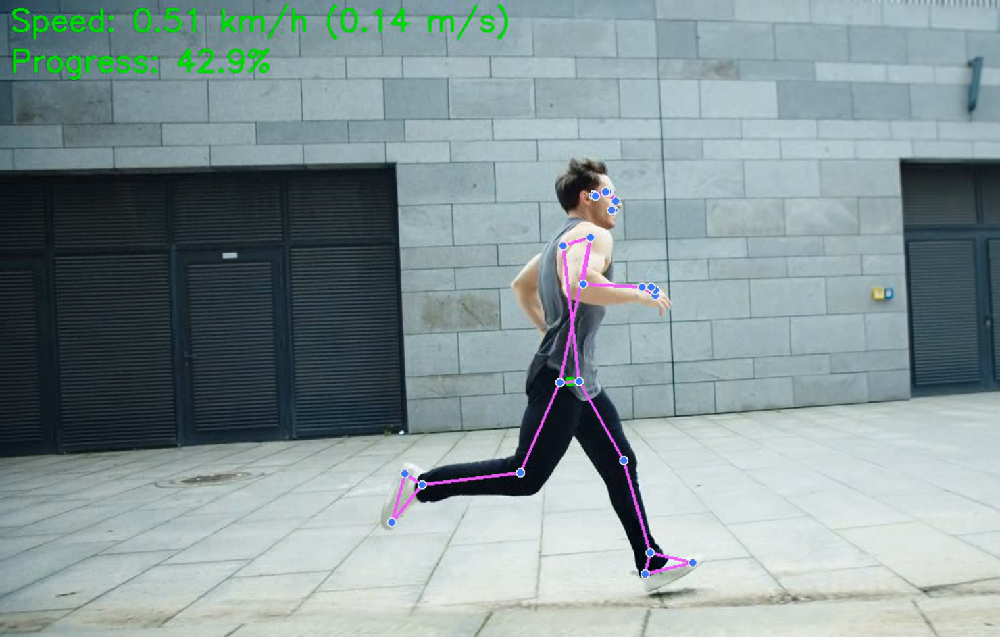

# Running Speed Calculator

Программа для автоматического определения скорости бега человека по видео с использованием технологии распознавания поз от MediaPipe





## Требования

- Python 3.6+
- OpenCV
- MediaPipe
- NumPy
- Matplotlib (для построения графиков)

```bash
pip install opencv-python mediapipe numpy matplotlib
```

## Использование

Базовый запуск:

```bash
python run_speed_calculator.py --video путь_к_видео.mp4
```

Расширенные опции:

```bash
python run_speed_calculator.py --video путь_к_видео.mp4 --output результат.mp4 --height 1.75 --scale 1.0
```

Параметры:

- `--video`: путь к входному видеофайлу (обязательный)
- `--output`: имя выходного файла (по умолчанию: output_speed.mp4)
- `--height`: рост человека в метрах для калибровки (по умолчанию: 1.7)
- `--scale`: дополнительный масштабный коэффициент (по умолчанию: 1.0)

## Как это работает

1. **Распознавание позы человека** – определение ключевых точек тела с помощью MediaPipe Pose
2. **Калибровка** – автоматический расчет коэффициента перевода пикселей в метры на основе роста человека
3. **Отслеживание движения** – определение перемещения центра масс (позиции бедер) на каждом кадре
4. **Расчет скорости** – вычисление скорости на основе перемещения и частоты кадров видео
5. **Визуализация** – отображение информации на видео и построение графика скорости

## Результаты

Программа выводит:

- Обработанное видео с визуализацией скелета и скорости
- Среднюю скорость бега за весь период видео
- Максимальную достигнутую скорость
- График изменения скорости по времени

## Ограничения

- Человек должен быть полностью виден в кадре
- Лучше всего работает при съемке сбоку
- Точность зависит от качества видео и освещения

## Пример вывода

```
FPS: 30.0
Разрешение: 1280x720
Всего кадров: 450
Калибровка: 320 пикселей = 1.19 метров
Коэффициент пересчета: 0.003719 м/пиксель
Время обработки: 45.23 секунд
Результат сохранен в файл: output_speed.mp4
Средняя скорость: 10.75 км/ч (2.99 м/с)
Максимальная скорость: 15.21 км/ч (4.23 м/с)
```
